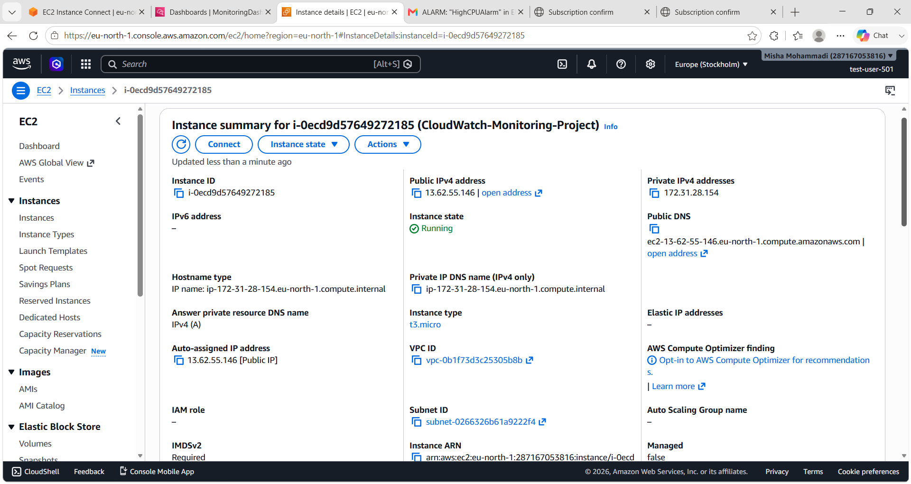
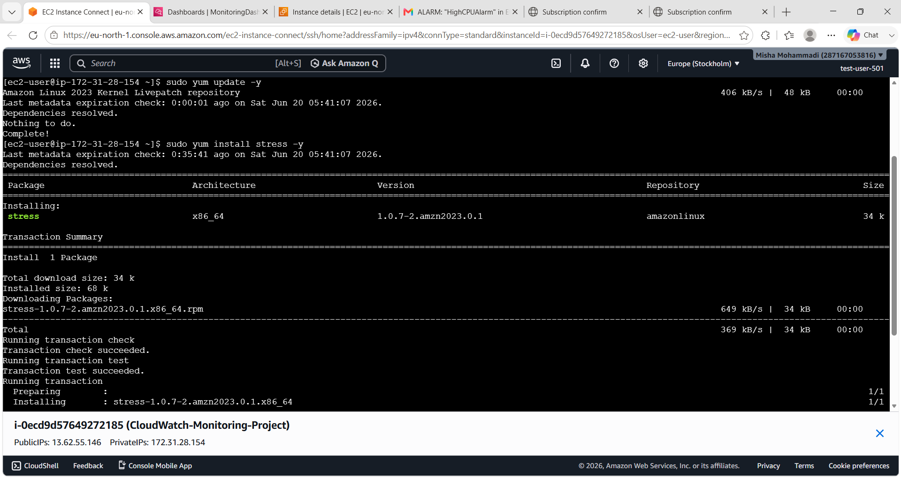
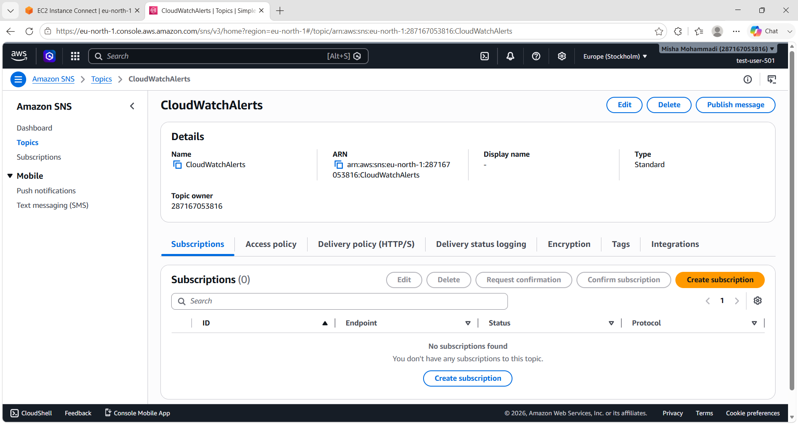
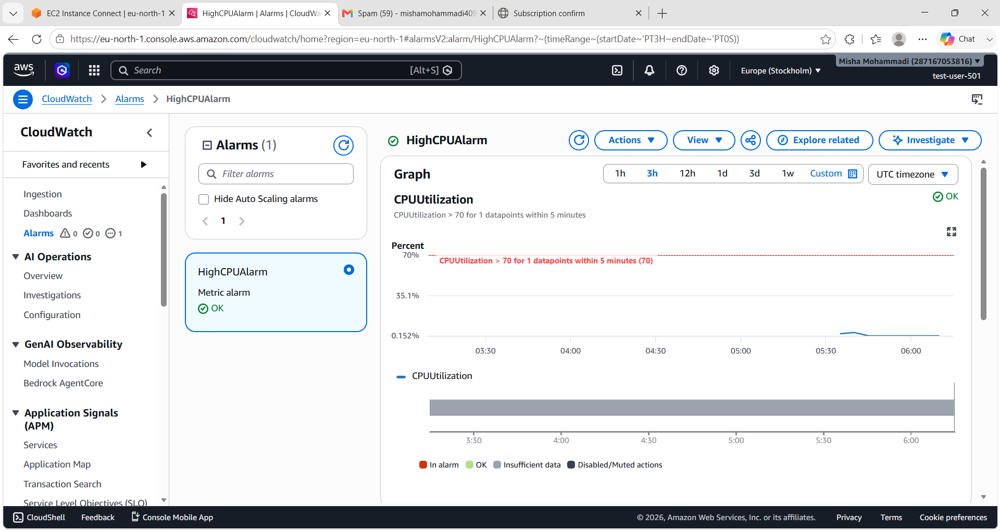
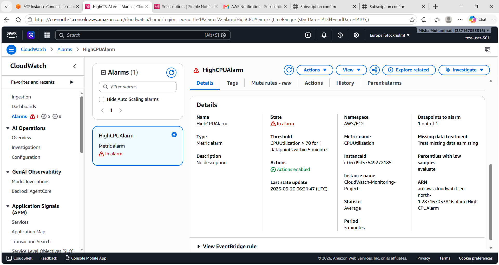
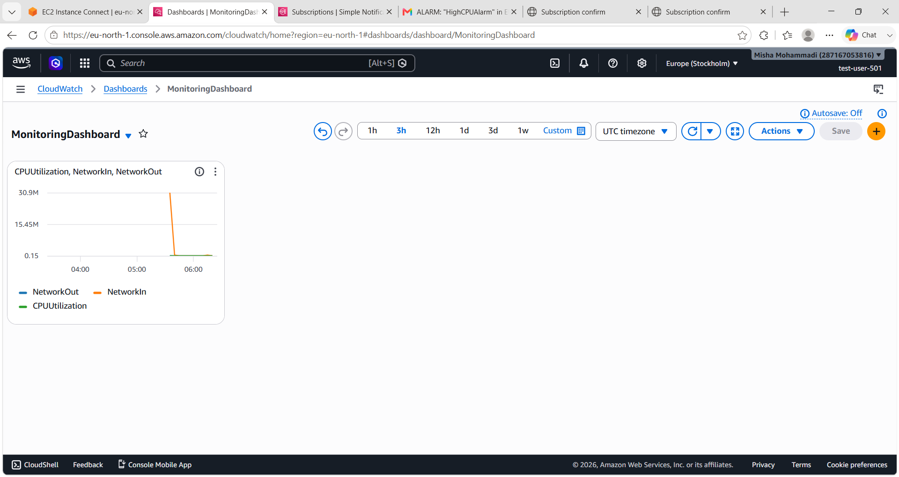
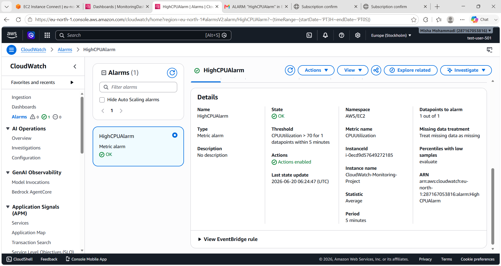

# AWS CloudWatch Monitoring and Alerting Project

## Project Overview

This project demonstrates how to monitor AWS resources using Amazon CloudWatch and configure automated alerts using Amazon SNS. An EC2 instance was launched and monitored through CloudWatch metrics, alarms, and dashboards. Email notifications were configured to receive alerts whenever CPU utilization crossed a defined threshold.

## Objectives

* Launch and monitor an EC2 instance.
* Explore CloudWatch metrics.
* Create CloudWatch alarms for CPU utilization.
* Configure Amazon SNS email notifications.
* Create a CloudWatch dashboard for visualization.
* Simulate high CPU usage and test alarm functionality.

## AWS Services Used

* Amazon EC2
* Amazon CloudWatch
* Amazon SNS (Simple Notification Service)

## Architecture

1. EC2 instance generates performance metrics.
2. CloudWatch collects and monitors metrics.
3. CloudWatch Alarm evaluates CPU utilization.
4. SNS sends email notifications when the threshold is exceeded.
5. CloudWatch Dashboard visualizes monitoring data.

## Implementation Steps

### Step 1: Launch EC2 Instance

* Launched an Amazon Linux EC2 instance.
* Instance type: t2.micro (Free Tier Eligible).
* Configured security group with SSH access.

### Step 2: Monitor Metrics

Navigated to CloudWatch Metrics and viewed:

* CPUUtilization
* NetworkIn
* NetworkOut
* DiskReadBytes
* DiskWriteBytes

### Step 3: Create SNS Topic

Created an SNS topic named:

CloudWatchAlerts

### Step 4: Create Email Subscription

* Added an email subscription.
* Confirmed the subscription through the email verification link.

### Step 5: Create CloudWatch Alarm

Configured an alarm with:

* Metric: CPUUtilization
* Threshold: Greater than 70%
* Evaluation: Static Threshold
* Notification: SNS Topic (CloudWatchAlerts)

### Step 6: Generate CPU Load

Connected to the EC2 instance and generated CPU stress using:

```bash
stress --cpu 2 --timeout 300
```

This increased CPU utilization and triggered the CloudWatch alarm.

### Step 7: Create Dashboard

Created a CloudWatch dashboard containing:

* CPU Utilization
* Network In
* Network Out

## Results

* Successfully monitored EC2 performance metrics.
* CloudWatch alarm transitioned from OK to ALARM state when CPU utilization exceeded the threshold.
* SNS email notifications were delivered successfully.
* Dashboard provided centralized monitoring of instance metrics.

## Screenshots

The screenshots folder contains evidence of:

## Screenshots

### EC2 Instance Running


### Connected to EC2 Terminal


### CloudWatch Metrics


### SNS Topic Created


### Email Subscription Confirmed


### CloudWatch Alarm Created


### Alarm Triggered


### SNS Email Notification


### CloudWatch Dashboard


### Alarm Returned to OK State


## Key Learnings

* Learned how CloudWatch collects and visualizes AWS metrics.
* Understood CloudWatch alarm creation and monitoring.
* Configured automated notifications using SNS.
* Gained hands-on experience with AWS monitoring and observability services.

## Conclusion

This project demonstrates a complete monitoring and alerting workflow using AWS CloudWatch and SNS. It provides real-time visibility into resource performance and automatically notifies administrators when predefined thresholds are exceeded, helping maintain system reliability and operational awareness.
